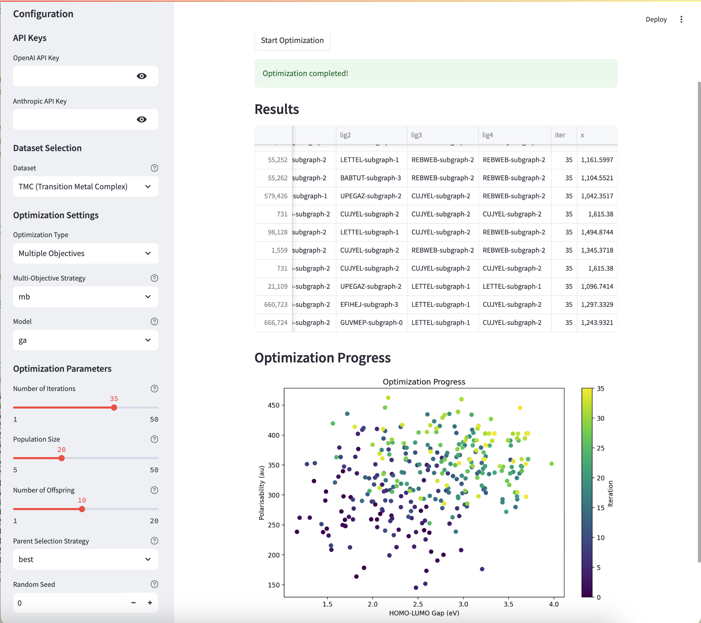

# LLM-EO: LLM-guided Evolutionary Optimization for TMC Design

LLM-EO is a novel framework that integrates Large Language Models (LLMs) into evolutionary optimization for designing functional transition metal complexes (TMCs). This approach leverages the inherent chemical knowledge of LLMs to efficiently navigate vast chemical spaces and optimize for desired properties.


## Description

* Utilizes LLMs for proposing new TMC candidates
* Supports both single-objective and multi-objective optimization
* Allows flexible optimization guided by natural language instructions
* Capable of generating novel ligands and TMCs beyond predefined chemical spaces
* Outperforms traditional genetic algorithms in efficiency and effectiveness

## Project Structure

```
├── LICENSE
├── README.md
├── data/ # Data directory
│ ├── 1M-space_50-ligands-full.csv # Original 50 ligands and properties
│ ├── ground_truth_fitness_values.csv # Pre-calculated fitness values
│ ├── lig10_Space.csv # 10-ligand space calculations
│ ├── lig50_top100_G.csv # Top performers for gap
│ ├── lig50_top100_P.csv # Top performers for polarisability
│ ├── lig50_top100_S.csv # Top performers for combined metrics
│ └── ligands10_maxBoth.csv # LLM-generated ligands optimizing both properties
├── environment.yml # Conda environment specification
├── llmeo/ # Main package directory
│ ├── init.py # Package initialization
│ ├── utils/ # Utility modules
│ │ ├── ga.py # Genetic algorithm implementation
│ │ ├── llm.py # LLM interface and handling
│ │ ├── mol_analysis.py # Molecular structure analysis
│ │ ├── mol_calculation.py # Property calculation utilities
│ │ └── utils.py # General utility functions
│ ├── cal_new_ligand_space.py # TMC enumeration script
│ ├── gen_new_TMCs.py # Direct LLM-based TMC generation
│ ├── llm_config.yaml # LLM configuration settings
│ ├── prompts.py # LLM prompt templates
│ ├── streamlit_app.py # Streamlit web interface
│ └── run_llmeo.py # Main execution script
└── tests/ # Test directory
```

## Getting Started

### Prerequisites

1. API Keys:
   * OpenAI GPT-4 API key (required)
   * Anthropic Claude API key (optional)

2. External Software:
   * **molSimplify**: For TMC structure generation
   * **GFN2-xTB**: For geometry optimization and property calculations
   * **Streamlit**: For interactive web interface, optional

### Installation

1. Clone the repository:
```bash
git clone https://github.com/deepprinciple/llmeo.git
cd llmeo
```

2. Download required dataset:
```bash
wget https://zenodo.org/records/14328055/files/ground_truth_fitness_values.csv -P data/
```

3. Install:
```bash
conda env create -f environment.yml    # install dependencies
pip install streamlit                   # install streamlit for web interface (optional)
conda activate llmeo
pip install -e .                        # install llmeo
```

4. Check installation (Optional):
```bash
pytest tests/
```

5. Configure API keys:
Create `llm_config.yaml` with your settings:
```yaml
OPENAI_API_KEY: "your-openai-key-here"  # optional
ANTHROPIC_API_KEY: "your-anthropic-key-here"  # Optional
GEMINI_API_KEY: "your-gemini-key-here"  # Optional
top_p: 1.0
max_tokens: 4096
```

### Usage

The main script `run_llmeo.py` provides various optimization options:

```bash
cd llmeo/
# Show all available options
python run_llmeo.py -h

# Run optimization with Claude model for polarisability and keep all history during iterations
python run_llmeo.py --prop polarisability --model claude-3-5-sonnet-20240620 --strategy all

# Run genetic algorithm optimization for maximizing polarisability with gap constraint
python run_llmeo.py --prop mpsg --model ga
```

### Command Line Options

```
usage: run_llmeo.py [-h] [--prop {gap,polarisability,pf,mb,mpsg}] 
                    [--num_iter NUM_ITER] [--population POPULATION] 
                    [--num_offspring NUM_OFFSPRING] [--seed SEED] 
                    [--model {ga,o1-preview,o1-mini,gpt-4,claude-3-5-sonnet-20240620}] 
                    [--strategy {best,all,const}] [--llm_config LLM_CONFIG] 
                    [--path PATH]

Optimization Properties:
  --prop              Choose optimization target:
                      - gap: Maximize HOMO-LUMO gap
                      - polarisability: Maximize molecular polarisability
                      - pf: Optimize Pareto frontier
                      - mb: Maximize both properties
                      - mpsg: Maximize polarisability with gap constraint

Configuration:
  --num_iter         Number of optimization iterations
  --population       Population size per generation
  --num_offspring    New TMCs per iteration
  --seed            Random seed for reproducibility
  --model           Model selection for TMC generation
  --strategy        Parent selection strategy
  --llm_config      Path to LLM configuration file
  --path           Output directory path
```

### Key Components

1. **Utility Modules** (`_utils/*`):
   - `ga.py`: Genetic algorithm implementation for TMC optimization
   - `llm.py`: LLM API interface and response handling
   - `mol_analysis.py`: Tools for analyzing molecular structures
   - `mol_calculation.py`: Property calculation implementations
   - `utils.py`: General utility functions

3. **Explore New Ligand Space** (`cal_new_ligand_space.py`):
   - Enumerates possible TMC combinations for a given ligand space
   - Calculates HOMO-LUMO gap and polarisability for each TMC
   - Usage:
     ```bash
     python cal_new_ligand_space.py
     ```

2. **Direct LLM Generation** (`gen_new_TMCs.py`):
   - Directly generates new TMC candidates using LLM
   - Workflow:
     1. Uses designed prompts to generate TMC components (Kernel: o1-preview or Claude-3.5-sonnet)
     2. Generates initial TMC structures using molSimplify
     3. Optimizes geometry and calculates properties using GFN2-xTB
     4. Saves results to CSV file
   - Usage:
     ```bash
     python gen_new_TMCs.py
     ```

### Interactive Web Interface

You can run the project through a user-friendly web interface powered by Streamlit:

```bash
streamlit run streamlit_app.py
```

This will launch a local web server and open the interface in your default browser.


*Results visualization and analysis*

## Citation

```bibtex
@article{Lu2024Oct,
    author = {Lu, Jieyu and Song, Zhangde and Zhao, Qiyuan and Du, Yuanqi and 
              Cao, Yirui and Jia, Haojun and Duan, Chenru},
    title = {Generative Design of Functional Metal Complexes Utilizing the 
              Internal Knowledge of Large Language Models},
    journal = {arXiv},
    year = {2024},
    month = oct,
    eprint = {2410.18136},
    doi = {10.48550/arXiv.2410.18136}
}
```

## Contact

For questions and support, please contact:
- Chenru Duan (duanchenru@gmail.com)
